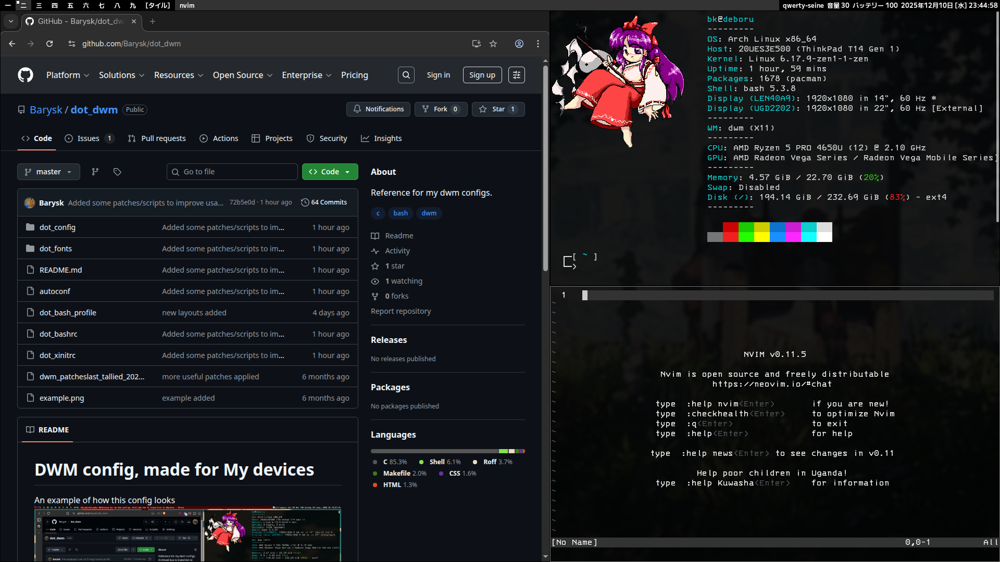

# DWM config, made for My devices

An example of how this config looks

[Map of dwm patches](http://coggle.it/diagram/X9IiSSM6PTWOM9Wz/t/dwm-patches-last-tallied-2024-09-27/d3448968e2509321527c3864cd4eee651e5f55e525582fdbf33be764972d9aef)

This build uses:
* dwm - window manager
    * activemonitor
    * alwayscenter
    * attachbottom
    * cfacts [ bottomstack, centermaster, deck ]
    * fixborders
    * fullscreen
    * movestack
    * pertag
    * smart_border_color [ by me ]
    * statusallmons
    * swapmonitors
    * systray
    * xinerma_monitors_xorder
* dwmblocks - same as slstatus but better
* dmenu - application menu
* j4-dmenu-desktop - wraper for dmenu
* kitty - terminal emulator
* slock - lockscreen [ bg_scale_and_blur, current_time, slock-noxbell ]
* mpv - media player
* picom - compositor
* feh - wallpaper
* flameshot - for screenshots
