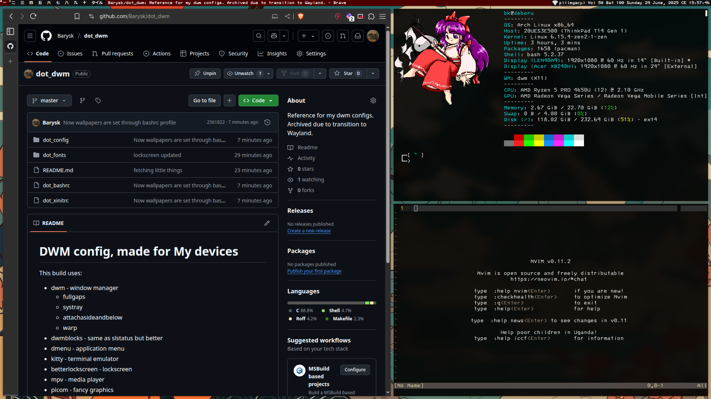

# DWM config, made for My devices

An example of how this config looks

[Map of dwm patches](http://coggle.it/diagram/X9IiSSM6PTWOM9Wz/t/dwm-patches-last-tallied-2024-09-27/d3448968e2509321527c3864cd4eee651e5f55e525582fdbf33be764972d9aef)

This build uses:
* dwm - window manager
    * actualfullscreen
    * alwayscenter
    * attachaside
    * fullgaps
    * pertag
    * systray
    * warp
* dwmblocks - same as slstatus but better
* dmenu - application menu
* kitty - terminal emulator
* betterlockscreen - lockscreen
* mpv - media player
* picom - fancy graphics
* feh - wallpaper
